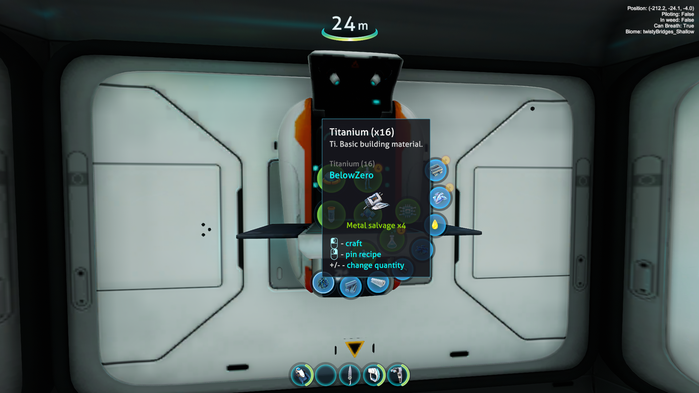
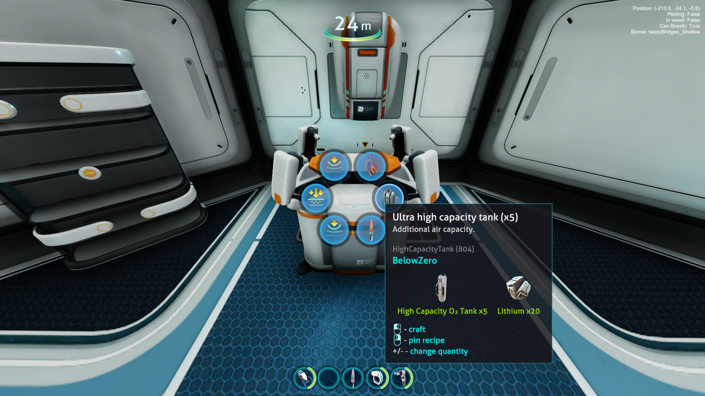

	<h1>MultiCraft</h1>
    
A re-creation of the BulkCraft mod for subnautica 1 allowing you to craft multiple things at once

**This mod is heavily inspired by [BulkCraft for Subnautica 1](https://github.com/bbalvanera/subnautica-mods).**

## Previews
<table>
	<tr>
		<td width="50%" align="center">
			
		</td>
		<td width="50%" align="center">
			
		</td>
	</tr>
</table>

## Requirements
- Subnautica: Below Zero
- BepInEx 5
- Nautilus for Below Zero

## Installation
1. Install BepInEx 5 and Nautilus for Subnautica: Below Zero.
2. Copy the built plugin DLL into your BepInEx plugins folder:
	 - `BepInEx/plugins/MultiCraft`
3. Launch the game and verify the mod loads in the BepInEx console/logs.